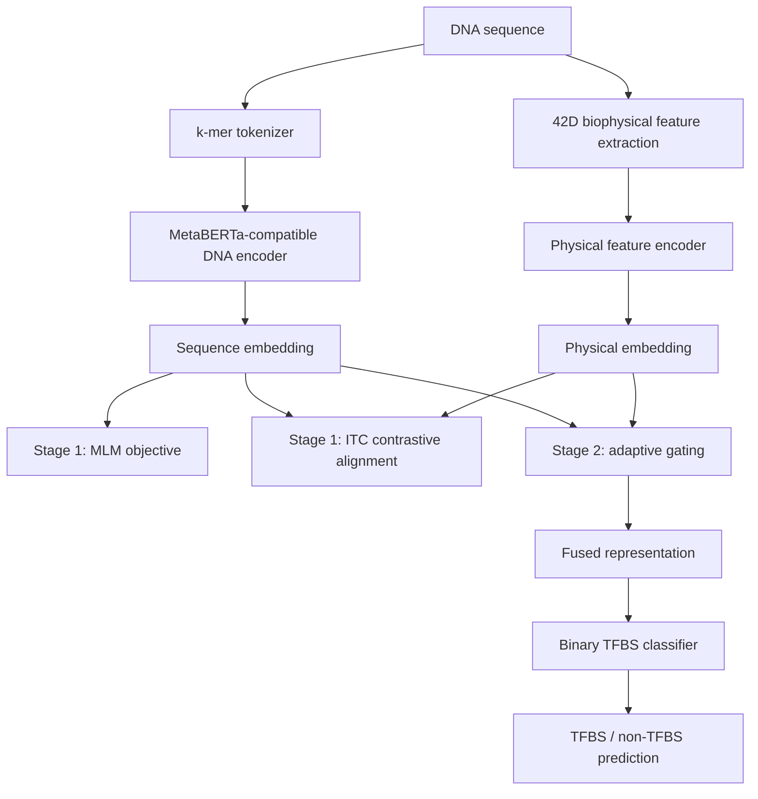

# BiPhysNet-TFBS Pipeline



## Text Summary

1. DNA sequences are tokenized into overlapping k-mers.
2. A DNA language-model encoder produces contextual sequence embeddings.
3. A 42D biophysical feature vector provides structural and thermodynamic evidence.
4. MLM and ITC objectives align sequence and physical representations during pretraining.
5. Adaptive gating fuses both branches during supervised fine-tuning.
6. The final classifier predicts whether the sequence is a TFBS.
```
DNA sequence
├── k-mer tokens -> sequence encoder -> sequence embedding
└── 42D features -> physical encoder -> physical embedding
                 -> MLM + ITC pretraining
                 -> adaptive gating
                 -> TFBS prediction
```
